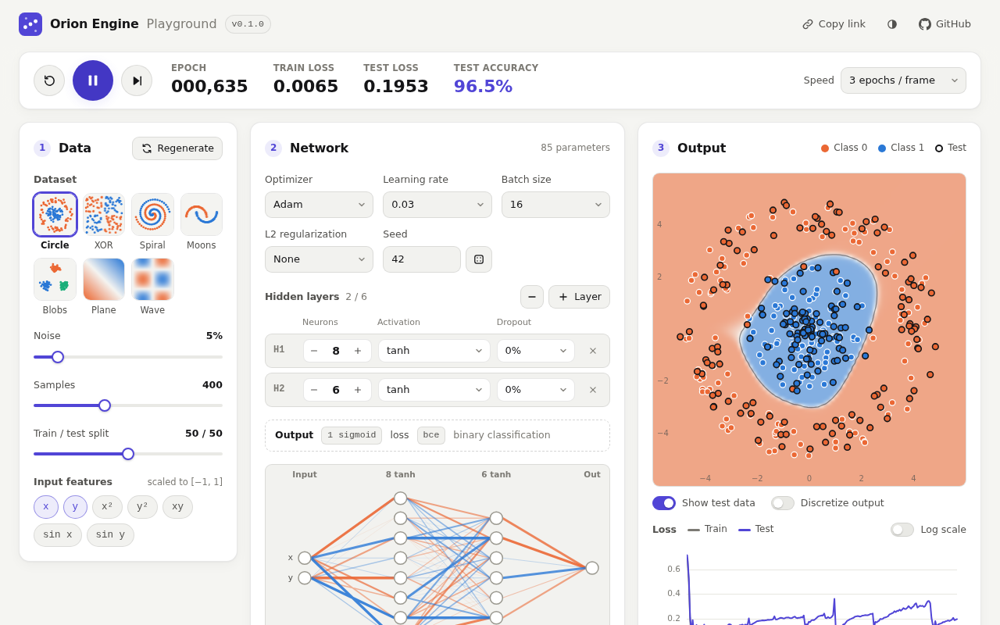

# Orion Engine

**Build, train and run neural networks in TypeScript, on Node.js and in the browser, with zero dependencies.**

[](https://github.com/Zzza38/orion-engine/actions/workflows/ci.yml)
[](https://www.npmjs.com/package/@zzza38/orion-engine)
[](LICENSE)
[](package.json)
[](package.json)

<a href="https://zzza38.github.io/orion-engine/">
  <picture>
    <source media="(prefers-color-scheme: dark)" srcset="docs/assets/playground-dark.png">
    <source media="(prefers-color-scheme: light)" srcset="docs/assets/playground-light.png">
    
  </picture>
</a>

<p align="center">
  <a href="https://zzza38.github.io/orion-engine/"><b>Open the playground</b></a> ·
  <a href="docs/guide.md">Guide</a> ·
  <a href="docs/api.md">API reference</a> ·
  <a href="examples">Examples</a> ·
  <a href="docs/migration.md">Migrating from 0.0.x</a> ·
  <a href="CHANGELOG.md">Changelog</a>
</p>

## Why Orion

- **Zero dependencies.** One small ESM package, nothing else to install or audit.
- **Runs everywhere JavaScript does.** The main entry point uses only globals shared by Node.js and browsers (a
  type-check enforces it); file helpers live in a separate `@zzza38/orion-engine/node` entry point.
- **TypeScript-first.** Written in strict TypeScript and shipped with declarations: option objects, layer configs and
  even `predict`'s return type (`number[]` in, `number[]` out) are typed.
- **A familiar API.** `Sequential`, `compile`, `fit`, `evaluate`, `predict`, callbacks and `History`: if you know Keras,
  you already know Orion.
- **Reproducible by default.** One seed drives weight initialization, shuffling and dropout, so the same seed, data and
  options give bit-identical weights and training history.
- **Fast where it counts.** Mini-batch training on `Float64Array` matrices with unrolled kernels, scratch buffers reused
  from step to step, and fused softmax/sigmoid + cross-entropy gradients: 4-5× the throughput of the 0.0.x engine on
  realistic layer sizes ([benchmarks](#performance)).
- **Portable model files.** A compact, checksummed binary format and a lossless JSON format, both readable in Node.js
  and the browser, plus an importer for 0.0.x `.onn` files. The [format is documented](docs/format.md).
- **Errors that tell you what to do.** Shape mismatches, bad options and diverging training throw typed errors whose
  messages name the problem and the fix.

## Install

```bash
pnpm add @zzza38/orion-engine
# or
npm install @zzza38/orion-engine
# or
yarn add @zzza38/orion-engine
```

Requires Node.js 22 or newer (or any modern browser). The package is ESM-only.

## Quick start

Learn XOR, the classic problem a linear model cannot solve:

```ts
import { dense, Sequential } from "@zzza38/orion-engine";

const x = [[0, 0], [0, 1], [1, 0], [1, 1]];
const y = [0, 1, 1, 0];

const model = new Sequential({ inputSize: 2, seed: 42, layers: [dense(8, "tanh"), dense(1, "sigmoid")] });
model.compile({ loss: "bce", optimizer: { name: "adam", learningRate: 0.05 }, metrics: ["accuracy"] });
model.fit(x, y, { epochs: 300, batchSize: 4 });

console.log(model.predict([1, 0])); // [0.998…]
console.log(model.evaluate(x, y)); // { loss: 0.0015…, accuracy: 1 }
```

Inputs are plain arrays with one row per sample (or a `Matrix`); targets for a single output can be a flat array.
`model.summary()` prints the architecture, and `fit(x, y, { verbose: 50 })` logs progress every 50 epochs.

## Usage

### Classification with softmax

For several classes, end with a `softmax` layer. With integer labels (`0, 1, 2, …`) use sparse categorical
cross-entropy (`"scce"`); with one-hot targets use `"cce"` (`oneHot(labels)` converts).

```ts
import { argmax, dense, Random, Sequential, StandardScaler, trainTestSplit } from "@zzza38/orion-engine";

// Three clusters of 2-D points; the labels are class indices 0, 1 and 2.
const rng = new Random(0);
const centers = [[-2, 0], [2, 0], [0, 2.5]];
const features = Array.from({ length: 300 }, (_, i) => centers[i % 3].map((c) => c + rng.normal(0, 0.7)));
const labels = features.map((_, i) => i % 3);

// Hold out a test set, and standardize features using statistics from the training set only.
const { xTrain, xTest, yTrain, yTest } = trainTestSplit(features, labels, { testSize: 0.2, seed: 1 });
const scaler = new StandardScaler();
const xTrainScaled = scaler.fitTransform(xTrain);
const xTestScaled = scaler.transform(xTest);

const model = new Sequential({ inputSize: 2, seed: 1, layers: [dense(16, "relu"), dense(3, "softmax")] });
model.compile({ loss: "scce", optimizer: { name: "adam", learningRate: 0.01 }, metrics: ["accuracy"] });
model.fit(xTrainScaled, yTrain, { epochs: 50, batchSize: 16 });

console.log(model.evaluate(xTestScaled, yTest)); // { loss: 0.0028…, accuracy: 1 }
console.log(model.predict(scaler.transform([2, 0]))); // class probabilities, ≈ [0, 1, 0]
console.log(argmax(model.predict(xTestScaled))); // predicted class of every test sample
```

For two classes, a single `sigmoid` unit with `"bce"` (binary cross-entropy) is the usual choice, as in the quick start.

### Regression

Leave the last layer linear (the default activation) and minimize mean squared error:

```ts
import { dense, Sequential } from "@zzza38/orion-engine";

const x = Array.from({ length: 200 }, (_, i) => [-1 + i / 100]); // one feature: one row per sample
const y = x.map(([v]) => Math.sin(Math.PI * v));

const model = new Sequential({ inputSize: 1, seed: 0, layers: [dense(32, "tanh"), dense(32, "tanh"), dense(1)] });
model.compile({ loss: "mse", optimizer: { name: "adam", learningRate: 0.005 }, metrics: ["mae"] });
const history = model.fit(x, y, { epochs: 400, batchSize: 16 });

console.log(history.last("meanAbsoluteError")); // ≈ 0.01 (metrics are logged under their canonical names)
console.log(model.predict([0.5])); // ≈ [1.006]
```

Two other regression losses are less sensitive to outliers: `"mae"` and `{ name: "huber", delta: 1 }`.

### Validation, callbacks and learning-rate schedules

`fit` can hold out validation data, and calls callbacks when training starts and ends, around every epoch and after
every batch. Everything `fit` measures ends up in the returned `History`.

```ts
import { cosineDecay, dense, earlyStopping, learningRateScheduler, Random, Sequential } from "@zzza38/orion-engine";

const rng = new Random(3);
const x = Array.from({ length: 400 }, () => [rng.uniform(-1, 1), rng.uniform(-1, 1)]);
const y = x.map(([a, b]) => (a * b > 0 ? 1 : 0)); // 1 in two opposite quadrants

const model = new Sequential({ inputSize: 2, seed: 3, layers: [dense(16, "relu"), dense(1, "sigmoid")] });
model.compile({ loss: "bce", optimizer: { name: "adam", learningRate: 0.01 }, metrics: ["accuracy"] });

const stopper = earlyStopping({ monitor: "valLoss", patience: 20, restoreBestWeights: true });
const history = model.fit(x, y, {
    epochs: 500,
    batchSize: 32,
    validationSplit: 0.2, // hold out the last 20% of the samples (shuffle ordered data first)
    verbose: 50, // log every 50th epoch
    callbacks: [stopper, learningRateScheduler(cosineDecay({ initial: 0.01, epochs: 500 }))],
});

console.log(history.best("valAccuracy")); // { epoch, value } of the best epoch
console.log(stopper.stoppedEpoch); // the epoch early stopping ended training, or null
```

Built-in callbacks: `earlyStopping`, `learningRateScheduler`, `reduceLROnPlateau` and `progressLogger`. A callback is
any object with some of `onTrainBegin`, `onEpochBegin`, `onBatchEnd`, `onEpochEnd` and `onTrainEnd`, and its context
can stop training (`ctx.stopTraining()`) or change `ctx.optimizer.learningRate`. See the [guide](docs/guide.md#callbacks).

### Saving and loading

In Node.js, import from `@zzza38/orion-engine/node`, which re-exports everything plus file helpers. The file format
follows the extension: `.json` (for example `model.onn.json`) writes JSON, anything else the binary format.

```ts
import { loadModel, saveModel } from "@zzza38/orion-engine/node";

await saveModel(model, "models/xor.onn"); // binary, float32 weights (compact)
await saveModel(model, "models/xor-exact.onn", { precision: "float64" }); // binary, bit-exact
await saveModel(model, "models/xor.onn.json", { pretty: true }); // human-readable JSON, bit-exact

const restored = await loadModel("models/xor.onn"); // detects the format from the content
restored.predict([1, 0]);
```

`saveModelSync` and `loadModelSync` do the same synchronously. In the browser (or anywhere), turn models into bytes or
strings with the main entry point:

```ts
import { deserializeModel, serializeModel } from "@zzza38/orion-engine";

const bytes = serializeModel(model); // Uint8Array
const text = serializeModel(model, { format: "json" }); // string, e.g. for localStorage

const fromBytes = deserializeModel(bytes);
const fromText = deserializeModel(text);
```

To load a file your page serves, `deserializeModel(new Uint8Array(await (await fetch("/model.onn")).arrayBuffer()))`.
A saved model keeps its architecture, weights and, if it was compiled, its loss, optimizer settings (including the
current learning rate) and metrics, so it comes back ready to predict or to keep training. Optimizer state (such as
Adam's moments) is not saved.

### Importing 0.0.x models

`.onn` files written by orion-engine 0.0.x load with the same functions; the format is detected automatically:

```ts
import { deserializeModel } from "@zzza38/orion-engine";

const legacy = deserializeModel("2:relu:2:swish\n0.71:-0.2:0.19|-1.82:0.95:0.97"); // or: await loadModel("old.onn")
console.log(legacy.predict([1, 0])); // [0.6398…, -0.2545…]
```

Save it again with `saveModel` to upgrade the file. The [migration guide](docs/migration.md) maps the whole 0.0.x API to
the new one.

### In the browser

With a bundler (Vite, esbuild, webpack, …), install the package and import it as usual. Without one, import it from a
CDN in a module script:

```html
<script type="module">
  import { dense, Sequential } from "https://esm.sh/@zzza38/orion-engine@0.1.0";
  // or "https://cdn.jsdelivr.net/npm/@zzza38/orion-engine@0.1.0/+esm"

  const model = new Sequential({ inputSize: 2, layers: [dense(8, "tanh"), dense(1, "sigmoid")] });
</script>
```

Long training runs should use `fitAsync`, which yields to the event loop every ~16 ms so the page stays responsive,
awaits async callbacks (to draw a chart, say), and stops when an `AbortSignal` fires:

```ts
const controller = new AbortController(); // e.g. call controller.abort() from a Stop button
await model.fitAsync(x, y, {
    epochs: 1000,
    signal: controller.signal,
    onEpochEnd: (epoch, logs) => console.log(epoch, logs.loss),
});
```

See [`examples/browser/index.html`](examples/browser/index.html) for a complete page, and the
[playground](https://zzza38.github.io/orion-engine/) for a bigger one.

### Reproducibility

Every random choice (weight initialization, shuffling, dropout masks) comes from the model's seeded generator:

```ts
import { dense, Sequential } from "@zzza38/orion-engine";

const train = () => {
    const model = new Sequential({ inputSize: 2, seed: 7, layers: [dense(4, "relu"), dense(1)] });
    model.compile({ loss: "mse" });
    model.fit([[0, 1], [1, 0], [1, 1]], [1, 1, 0], { epochs: 20 });
    return model.getWeights();
};
console.log(JSON.stringify(train()) === JSON.stringify(train())); // true
```

Without a `seed`, a random one is picked; read it back from `model.seed` to reproduce the run. `trainTestSplit`,
`shuffleTogether` and `deserializeModel` take their own `seed`. Results are bit-identical on the same JavaScript
engine; different engines may round `Math.exp` and friends differently in the last bit.

### Custom layers

Extend `BaseLayer` for a layer that plugs into `Sequential`, and register it so saved models can rebuild it:

```ts
import type { LayerConfig, Matrix } from "@zzza38/orion-engine";
import { BaseLayer, dense, registerLayer, scale, Sequential } from "@zzza38/orion-engine";

/** Multiplies its input by a constant. */
class Scale extends BaseLayer {
    readonly type = "scale";

    constructor(readonly factor: number, name = "") {
        super(name); // "" lets the model name it ("scale_1", …)
    }

    protected onBuild(): void {} // no parameters to create

    forward(input: Matrix, _training: boolean): Matrix {
        this.checkInput(input);
        return scale(input, this.factor);
    }

    propagate(gradOutput: Matrix, inputGradient: boolean): Matrix | null {
        return inputGradient ? scale(gradOutput, this.factor) : null;
    }

    getConfig(): LayerConfig {
        return { type: this.type, name: this.name, factor: this.factor };
    }
}
registerLayer("scale", (config) => new Scale(config.factor as number, config.name));

const model = new Sequential({ inputSize: 3, layers: [new Scale(0.1), dense(1)] });
```

Layers with weights create `LayerParameter`s in `onBuild` and return them from `parameters()`; see
[`BaseLayer`](docs/api.md#baselayer) and the built-in layers in [`src/layers`](src/layers).

## What's included

| Layers | Factory | Notes |
|---|---|---|
| `Dense` | `dense(units, activation?)` or `dense(units, options)` | Fully connected; optional L1/L2 kernel regularization, initializers, `useBias` |
| `Dropout` | `dropout(rate)` | Inverted dropout, active only during training |
| `BatchNormalization` | `batchNormalization(options?)` | Batch statistics in training, moving averages in inference; momentum 0.99, epsilon 1e-3 |
| `ActivationLayer` | `activation(name)` | A standalone activation, e.g. after batch normalization |

| Activations | |
|---|---|
| Classic | `linear` (default), `sigmoid`, `hardSigmoid`, `tanh`, `softsign`, `softmax` |
| ReLU family | `relu`, `relu6`, `leakyRelu` (`alpha` 0.01), `elu` (`alpha` 1), `selu` |
| Smooth ReLU alternatives | `gelu` (tanh approximation), `swish`, `mish`, `softplus` |

| Loss | Aliases | Use for |
|---|---|---|
| `meanSquaredError` | `mse` | Regression |
| `meanAbsoluteError` | `mae` | Regression, robust to outliers |
| `huber` | | Regression; quadratic below `delta` (default 1), linear above |
| `binaryCrossentropy` | `bce` | Binary / multi-label classification with `sigmoid` outputs |
| `categoricalCrossentropy` | `cce` | Multi-class with `softmax` and one-hot targets |
| `sparseCategoricalCrossentropy` | `scce` | Multi-class with `softmax` and integer class labels |

| Optimizer | Default learning rate | Options |
|---|---|---|
| `sgd` | 0.01 | `momentum`, `nesterov`, `weightDecay` |
| `adam` (the default) | 0.001 | `beta1`, `beta2`, `epsilon`, `amsgrad` |
| `adamw` | 0.001 | As Adam, plus decoupled `weightDecay` (0.01) |
| `rmsprop` | 0.001 | `rho`, `momentum`, `epsilon`, `centered` |
| `adagrad` | 0.01 | `initialAccumulatorValue`, `epsilon` |

Every optimizer also takes `clipNorm` and `clipValue` for gradient clipping.

| Metric | Aliases | Notes |
|---|---|---|
| `accuracy` | | Binary accuracy with a `bce` loss; otherwise binary, sparse categorical or categorical, from the shapes |
| `binaryAccuracy`, `categoricalAccuracy`, `sparseCategoricalAccuracy` | | Explicit variants |
| `meanSquaredError`, `meanAbsoluteError`, `rootMeanSquaredError` | `mse`, `mae`, `rmse` | Regression |

| Initializers | |
|---|---|
| Variance scaling | `glorotUniform` (Dense default), `glorotNormal`, `heUniform`, `heNormal`, `lecunUniform`, `lecunNormal` |
| Fixed and random | `zeros` (bias default), `ones`, `constant`, `randomUniform`, `randomNormal` |

| Learning-rate schedules | |
|---|---|
| `constantSchedule(lr)` | The same rate every epoch |
| `stepDecay({ initial, factor, every })` | Multiply by `factor` every `every` epochs |
| `exponentialDecay({ initial, rate, every? })` | Smooth exponential decay |
| `cosineDecay({ initial, epochs, minimum? })` | Cosine annealing to `minimum` |
| `piecewiseConstant({ boundaries, values })` | Fixed rates between epoch boundaries |
| `linearWarmup(schedule, { epochs, from? })` | Linear warm-up before any other schedule |

| Callbacks | |
|---|---|
| `earlyStopping(options?)` | Stop when a monitored value stops improving, optionally restoring the best weights |
| `learningRateScheduler(schedule)` | Set the learning rate every epoch from a schedule or any function |
| `reduceLROnPlateau(options?)` | Cut the learning rate when progress stalls |
| `progressLogger(options?)` | Log a line every N epochs (`fit`'s `verbose` option adds one) |

Also included: data helpers (`StandardScaler`, `MinMaxScaler`, `oneHot`, `argmax`, `trainTestSplit`,
`shuffleTogether`), a `Matrix` class with the operations the layers use, a seeded `Random`, and low-level codecs for the
model formats. The [API reference](docs/api.md) covers every export.

## Performance

Training throughput and single-sample inference latency, measured with `pnpm bench` on a 4-vCPU Intel Xeon (2.1 GHz)
cloud VM with Node.js 22.22 (single-threaded). The 0.0.x engine could only update the weights after every sample, while
0.1 trains on mini-batches of 32 with the same plain SGD. Speedups over 0.0.2 are in parentheses.

| Network | Engine | Train (samples/s) | Predict 1 sample (µs) |
|---|---|--:|--:|
| XOR 2-4-1 | orion 0.1 (batch 32) | 1,134,185 (3.3×) | 0.71 (0.9×) |
| | legacy 0.0.2 (per sample) | 343,773 | 0.64 |
| MLP 64-128-10 | orion 0.1 (batch 32) | 69,756 (4.7×) | 9.40 (3.7×) |
| | legacy 0.0.2 (per sample) | 14,894 | 34.39 |
| MNIST-size 784-128-10 | orion 0.1 (batch 32) | 8,256 (4.9×) | 75.86 (4.4×) |
| | legacy 0.0.2 (per sample) | 1,680 | 334.62 |

On realistic layer sizes, 0.1 trains about 5× and predicts about 4× faster. XOR has only 4 samples (so every batch has
4), and both engines are dominated by per-call overhead; its numbers also vary the most between runs. Results depend on
the hardware: run `pnpm bench` to measure yours.

## Documentation

- [Guide](docs/guide.md): concepts, data preparation, training tips, async training and troubleshooting.
- [API reference](docs/api.md): every export, with signatures and defaults.
- [Model file formats](docs/format.md): the binary, JSON and legacy formats, byte by byte.
- [Migrating from 0.0.x](docs/migration.md): the old API mapped to the new one.
- [Examples](examples): XOR, Iris, regression, spirals, saving and loading, async training and a browser page.
  Run them all with `pnpm examples`.
- [Playground](https://zzza38.github.io/orion-engine/): train networks in your browser and export the code.
- [Changelog](CHANGELOG.md)

## Contributing

Contributions are welcome. [CONTRIBUTING.md](CONTRIBUTING.md) covers setup, the scripts, testing expectations
(including gradient checks) and the release process. Before opening a pull request, run:

```bash
pnpm check && pnpm typecheck && pnpm test
```

## License

[Apache-2.0](LICENSE). Copyright 2025 Zzza38; see [NOTICE](NOTICE).
